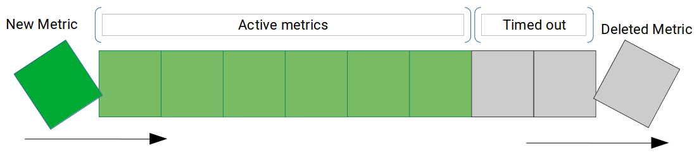

# Back End Software Engineer
## Test Assignment

### Resources
Here's a [recording](https://drive.google.com/file/d/10h4Vb4LBDT1I0zw82nSCKdD2x608yXF9/view?usp=sharing) of how the application works in production.

## How it's made
The assignment has it as a requirement to get rid of metrics when they are older than an hour. To solve this, this solution implements what's called a *Timed Metric*. This is a metric that will, after a 1-hour timeout signal that it is no longer valid and should be discarded. The following image describes a metric's lifecycle.

**Timed metrics are stored in metrics queues**. When the timed metrics time out, they emit an event that is handled by the queues as a request to delete the emitter from the queue.
The following image shows metric transition starting when it is created until when it is deleted from the queue.

**Queues are stored in a store**. A store is a map-like data structure that associates a string key with a queue. When a metric is logged, it is always logged for a given key. The store will route the metric being stored to the proper queue.
## Testing
### On your local machine
- Run `npm run test` to run the tests
- Run `npm run live` to run the server live and perform tests against it.

When you run `npm run live` you can perform tests by opening the html files `tools/watcher.html` to watch how the sums rise and fall as new metrics are logged. `tools/client.html` to log metrics by pressing on **Send**.

### In production
Go to https://burned-arcade.herokuapp.com to see the server in production.
